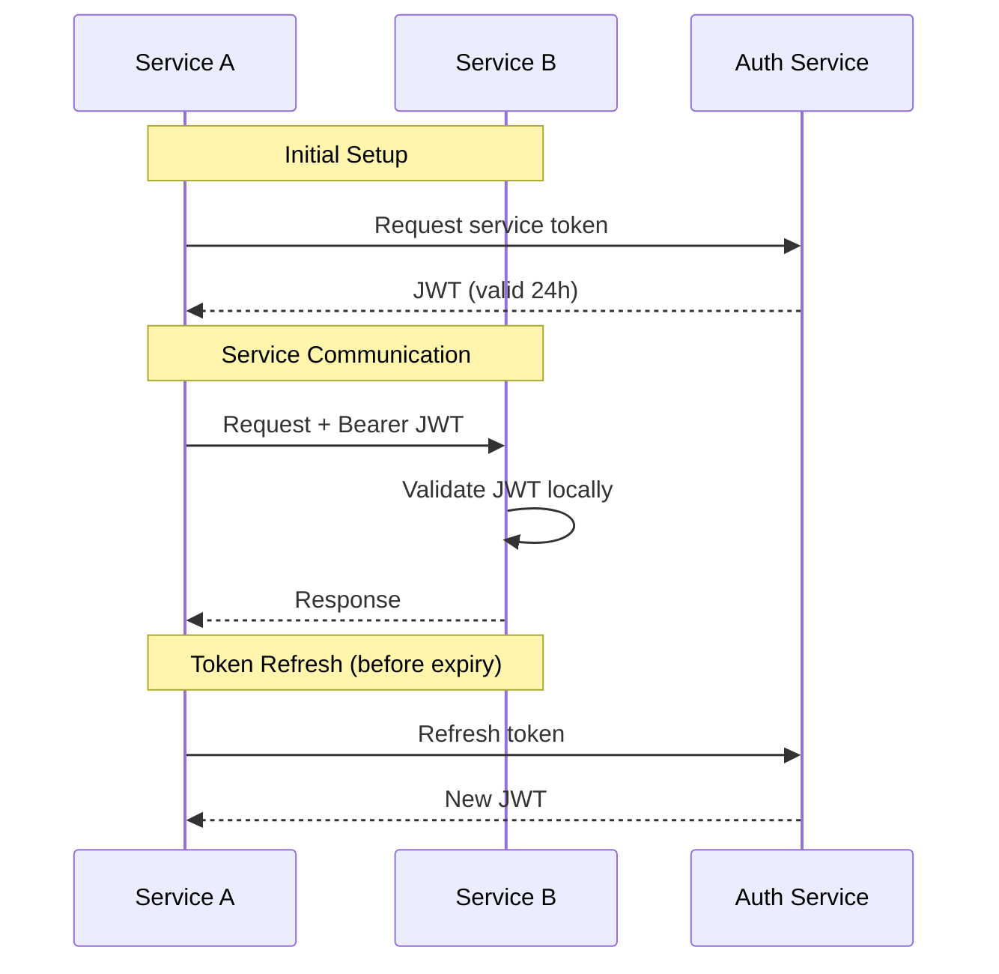

# Inter-Service Authentication Strategy

**Created on**: July 6, 2025 at 1:00 PM UTC by Claude Code  
**Status**: 🟡 Design Phase  
**Priority**: P0 - Critical Blocker for Microservices Migration

## Overview

This document defines the authentication and authorization strategy for secure communication between STOMATON microservices. The strategy ensures that only authorized services can communicate with each other while maintaining security, performance, and operational simplicity.

## Architecture Decision

After evaluating multiple approaches, we recommend **Option 2: Shared Secret with JWT** as the optimal solution for STOMATON's needs.

### Options Evaluated

#### Option 1: mTLS (Mutual TLS) ❌
- **Pros**: Industry standard, very secure, built-in to most service meshes
- **Cons**: Complex certificate management, operational overhead, overkill for 20 users
- **Decision**: Too complex for our small team without dedicated DevOps

#### Option 2: Shared Secret with JWT ✅ RECOMMENDED
- **Pros**: Simple to implement, stateless, good security, easy key rotation
- **Cons**: Requires secure secret distribution
- **Decision**: Best balance of security and simplicity for our use case

#### Option 3: API Keys per Service ❌
- **Pros**: Simple, each service has unique credentials
- **Cons**: O(n²) key management complexity, harder to rotate
- **Decision**: Too many keys to manage as services grow

#### Option 4: OAuth2/OIDC ❌
- **Pros**: Standard protocol, fine-grained permissions
- **Cons**: Requires auth server, complex for service-to-service
- **Decision**: Overcomplicated for internal services

## Implementation Design

### 1. Authentication Flow



### 2. JWT Token Structure

```json
{
  "header": {
    "alg": "HS256",
    "typ": "JWT"
  },
  "payload": {
    "iss": "stomaton-auth-service",
    "sub": "stomaton-content-service",
    "aud": ["stomaton-*"],
    "exp": 1720368000,
    "iat": 1720281600,
    "jti": "550e8400-e29b-41d4-a716-446655440000",
    "permissions": [
      "database:read",
      "database:write",
      "cache:read",
      "cache:write"
    ]
  }
}
```

### 3. Service Registry

Each service must register with the Auth Service on startup:

```python
# In each service's main.py
async def startup_event():
    # Register with auth service
    auth_client = ServiceAuthClient(
        service_name="stomaton-content-service",
        service_key=os.getenv("SERVICE_KEY"),
        auth_service_url=os.getenv("AUTH_SERVICE_URL")
    )
    
    # Get initial service token
    service_token = await auth_client.get_service_token()
    
    # Store in app state for use in requests
    app.state.service_token = service_token
    app.state.auth_client = auth_client
```

### 4. Making Authenticated Requests

```python
# Making requests to other services
async def call_database_service(data: dict):
    headers = {
        "Authorization": f"Bearer {app.state.service_token}",
        "X-Service-Name": "stomaton-content-service"
    }
    
    async with httpx.AsyncClient() as client:
        response = await client.post(
            f"{DATABASE_SERVICE_URL}/api/internal/stones",
            json=data,
            headers=headers
        )
    
    return response.json()
```

### 5. Validating Incoming Requests

```python
# Middleware for validating service requests
async def validate_service_token(request: Request, call_next):
    # Skip validation for health checks
    if request.url.path == "/health":
        return await call_next(request)
    
    # Only validate internal API routes
    if request.url.path.startswith("/api/internal/"):
        auth_header = request.headers.get("Authorization")
        if not auth_header or not auth_header.startswith("Bearer "):
            return JSONResponse(
                status_code=401,
                content={"error": "Missing or invalid authorization"}
            )
        
        token = auth_header.split(" ")[1]
        try:
            # Validate JWT with shared secret
            payload = jwt.decode(
                token,
                settings.JWT_SECRET,
                algorithms=["HS256"],
                audience="stomaton-*"
            )
            
            # Add service info to request state
            request.state.service_name = payload["sub"]
            request.state.permissions = payload.get("permissions", [])
            
        except jwt.ExpiredSignatureError:
            return JSONResponse(
                status_code=401,
                content={"error": "Token expired"}
            )
        except jwt.InvalidTokenError:
            return JSONResponse(
                status_code=401,
                content={"error": "Invalid token"}
            )
    
    return await call_next(request)
```

## Security Configuration

### 1. Environment Variables

Each service needs these environment variables:

```bash
# Service identity
SERVICE_NAME=stomaton-content-service
SERVICE_KEY=<unique-service-key>

# Auth service
AUTH_SERVICE_URL=http://stomaton-auth-service:8006
JWT_SECRET=<shared-secret-for-jwt-validation>

# Token settings
SERVICE_TOKEN_EXPIRY=86400  # 24 hours
SERVICE_TOKEN_REFRESH=3600  # Refresh 1 hour before expiry
```

### 2. Secret Management

**Development**:
```bash
# .env.development
JWT_SECRET=dev-secret-change-in-production
SERVICE_KEY=dev-key-content-service
```

**Production** (Railway):
- Use Railway's environment variable groups
- Different JWT_SECRET per environment
- Rotate secrets quarterly
- Never commit secrets to git

### 3. Network Security

```yaml
# Each service should only expose internal APIs to other services
services:
  content-service:
    networks:
      - internal
      - public
    environment:
      INTERNAL_API_PORT: 8001
      PUBLIC_API_PORT: 8000

networks:
  internal:
    internal: true  # Not accessible from outside
  public:
    external: true
```

## Implementation Checklist

### Phase 1: Auth Service Enhancement (Day 1)
- [ ] Add service token generation endpoint
- [ ] Add service registration endpoint
- [ ] Add token refresh endpoint
- [ ] Add service key validation
- [ ] Create ServiceAuthClient SDK

### Phase 2: Service Integration (Day 2)
- [ ] Add auth middleware to each service
- [ ] Separate internal vs public API routes
- [ ] Add service registration on startup
- [ ] Add automatic token refresh
- [ ] Update service-to-service calls

### Phase 3: Testing & Monitoring (Day 3)
- [ ] Create integration tests for auth flow
- [ ] Add auth metrics (token generation, validation, failures)
- [ ] Test token expiry and refresh
- [ ] Test permission validation
- [ ] Document troubleshooting guide

## Service Permissions Matrix

| Service | Database | Cache | RAG | Auth | Monitoring |
|---------|----------|-------|-----|------|------------|
| Content | RW | RW | RW | R | W |
| Search | R | RW | RW | R | W |
| Flywheel | RW | RW | RW | R | W |
| Monitoring | R | R | R | R | RW |
| Gateway | - | R | - | R | W |

**Legend**: R = Read, W = Write, RW = Read/Write, - = No access

## Error Handling

### Common Auth Errors

1. **Token Expired**
   - Auto-refresh before expiry
   - Fallback: Re-authenticate
   - Log: Token refresh failures

2. **Invalid Token**
   - Check JWT_SECRET match
   - Verify issuer/audience
   - Log: Validation failures

3. **Service Not Found**
   - Check service registration
   - Verify SERVICE_NAME
   - Log: Registration attempts

### Monitoring & Alerts

```python
# Key metrics to track
auth_metrics = {
    "token_generation_total": Counter,
    "token_validation_total": Counter,
    "token_validation_failures": Counter,
    "token_refresh_total": Counter,
    "service_registration_total": Counter,
}

# Alert conditions
alerts = [
    {
        "name": "High auth failure rate",
        "condition": "rate(token_validation_failures) > 10/min",
        "severity": "warning"
    },
    {
        "name": "Service registration failing",
        "condition": "service_registration_failures > 0",
        "severity": "critical"
    }
]
```

## Migration Plan

### Day 1: Preparation
1. Deploy enhanced Auth Service
2. Generate SERVICE_KEYs for each service
3. Configure JWT_SECRET in all environments

### Day 2: Service Updates  
1. Update services with auth middleware
2. Add service registration logic
3. Test service-to-service communication

### Day 3: Cutover
1. Enable auth validation on all internal routes
2. Monitor auth metrics
3. Have rollback plan ready

## Security Best Practices

1. **Rotate Secrets Quarterly**
   - JWT_SECRET rotation with overlap period
   - SERVICE_KEY rotation one service at a time

2. **Audit Logging**
   - Log all auth attempts (success/failure)
   - Track service-to-service communication
   - Alert on anomalies

3. **Least Privilege**
   - Services only get permissions they need
   - Regularly review permission matrix
   - Remove unused permissions

4. **Defense in Depth**
   - Network isolation (internal network)
   - Application auth (JWT validation)
   - Monitoring and alerting

## FAQ

**Q: Why not use Istio/Linkerd service mesh?**  
A: Too complex for our small team. We need simplicity over advanced features.

**Q: How do we handle token refresh?**  
A: Services automatically refresh tokens 1 hour before expiry. If refresh fails, they re-authenticate.

**Q: What if the Auth Service is down?**  
A: Services cache valid tokens for 24h. Auth service downtime < 24h won't affect operations.

**Q: How do we revoke a compromised service key?**  
A: Remove from Auth Service, optionally force JWT_SECRET rotation for immediate effect.

## Next Steps

1. Review and approve this design
2. Implement Auth Service enhancements
3. Create ServiceAuthClient SDK
4. Update first service as proof of concept
5. Roll out to all services

---

*This authentication strategy provides the right balance of security and simplicity for STOMATON's microservices architecture.*